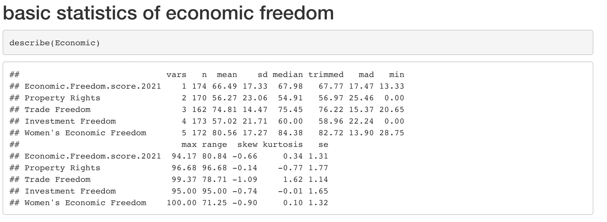
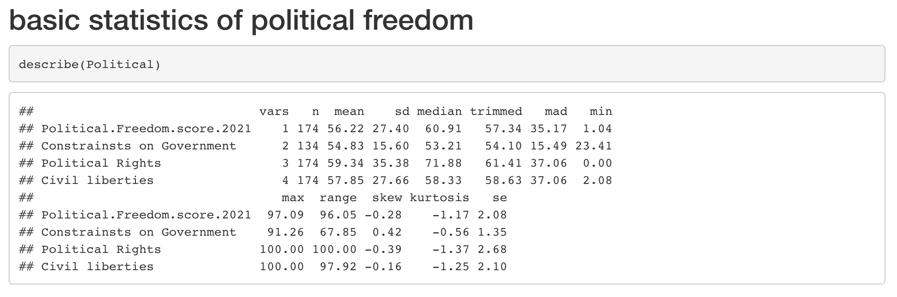
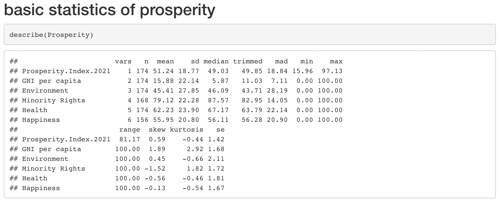

```{r setup, include=FALSE}
knitr::opts_chunk$set(echo = FALSE)
```

## Introduction

TODO: Add your names in *author* above. If you would like to add images/plots, upload the images to github then use the image link to import to this rmarkdown file. Knit to generate the presentation.

**NOTE**: PLEASE REMEMBER TO **FETCH/PULL BEFORE COMMIT**. This will help reducing the number of possible merging errors as the presentation is a single file


## Exploratory Analysis - Descriptive Statistics

Here are metadata of "freedom and propserity index" dataset:

- Number of countries: 174
- Number of regions: 6
- Region classification: Asia Pacific, Middle Eastern Asia, America, Western Europe, Europe and Central Asia, Sub Saharan Africa
- Years recorded: 2006, 2011, 2016, 2021
- Freedom categories: Economic, Political, Legal
- Number of economic subcategories: 4
- Number of political subcategories: 3
- Number of legal subcategories:10 (this is different from the pie chart given by Atlantic Council)
- Number of prosperity categories: 5

In addition, we also calculate the basic statistics of each variables based on its categories. The following is our result. 
{width=100%}
{width=100%}
{width=100%}
{width=100%}

## Exploratory Analysis - Correlations 

We will investigate the correlations between the main categories of Freedom and Prosperity against their subcategories. Next, we will dive into the specific factors of Freedom and obtain the factors that have are highly correlated with the subcategories of Freedom.

## Freedom and its Main Categories


{width=100%}

## Prosperity and its Main Cateogries

{width=100%}

## Freedom Subcategory (1)

{width=80%}

## Freedom Subcategory (2)

{width=100%}

## Freedom Subcategory (3)

{width=80%}


## Statistical Learning Methods

For the following slides, we will be looking at various statistical models that will help with this data analysis project.

## Linear Regression - General Scores

{width=60%}

From this plot we can infer that there seems to be an upward curve resembling an exponential relationship. As there seems to be two large clusters, we will attempt to cluster the groups using Gaussian Mixture Model method.

## Gaussian Mixture Model Clustering

{width=60%}

We can see from the clusters above that there are two clustered groups between the free and prosporous countries against the unfree and unprosperous countries.

{width=80%}


## Statistical Learning with Trees

We use several supervised learning methods to build prediction models for prosperity scores based on all the freedom subcategories, and compare their performances. 

## Data Processing and prediction settings 
Our data source is from the Atlantic Council. For every country starting from 2006 and in every 5 years, the Atlantic give it a score for every freedom subcategories and prosperity. Using these scores, we form the training and testing data set. Since the algorithmic models we intend to use are designed for predicting discrete values, we have to classify the propserity socres into resonable partitions.In achieving this, the following basic statistical inferneces are made:

| mean | median | maximum | minimum | standard deviation| 
| :----: | :----: | :----: | :----: | :----: |
| 48.38 | 50.57 | 98.63 | 15.47 | 19.05 |

The following is the visualization of distribution of prosperity scores amongst all data. 


## Decision Tree

...

## Random Forest

...

## 

## Neural Network

...


## Time Series Data Analysis with Raw Data

Understanding what variables are important according the correlations of the normalized scores, we will check the current situation of some countries and investigate if the raw data aligns with our findings from the scored dataset.

## Country A

...

## Country B

...


## Conclusion

To summarize, we have learned that ...


