```{r setup, include=FALSE}
knitr::opts_chunk$set(echo = FALSE)
```

## Introduction

TODO: Add your names in *author* above. If you would like to add images/plots, upload the images to github then use the image link to import to this rmarkdown file. Knit to generate the presentation.

**NOTE**: PLEASE REMEMBER TO **FETCH/PULL BEFORE COMMIT**. This will help reducing the number of possible merging errors as the presentation is a single file


## Exploratory Analysis - Descriptive Statistics

### Overview

Our project is based around analysis of the Freedom and Prosperity dataset from the Atlantic Council Freedom and Prosperity Center. This dataset has detailed data on 174 countries of the world, split into 6 geographical regions. The regions, along with their abbreviations, are listed below. We will be using these abbreviations throughout our project reports.

- America: **AME** (32 countries)
- Asia Pacific: **AP** (28 countries)
- Europe and Central Asia: **ECA** (18 countries)
- Middle Eastern Asia: **MENA** (18 countries)
- Sub Saharan Africa: **SSA** (47 countries)
- Western Europe: **WE/EU** (31 countries)

All data points in our dataset were recorded multiple times over a 15 year period - during 2006, 2011, 2016, and 2021.

The data covers freedom and prosperity, with detailed categories for each to give further insight into specifics of each country's freedom and prosperity conditions. The freedom data is split into three categories:

- **Economic Freedom** (4 additional subcategories)
- **Political Freedom** (3 additional subcategories)
- **Legal Freedom** (10 additional subcategories)

The prosperity data is split into five categories:

- **Income**
- **Environment**
- **Minority Rights**
- **Health**
- **Happiness**

Values for the overall categories were calculated by taking the average of all individual subcategory values.

### Initial Analysis

We start by analyzing the overall scores for freedom and prosperity. Descriptive statistics for each variable is shown in the table below:

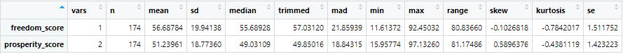{width=100%}

Here is a graph displaying scores for each country, colored by region. This coloring will stay consistent throughout the initial descriptive data analysis.

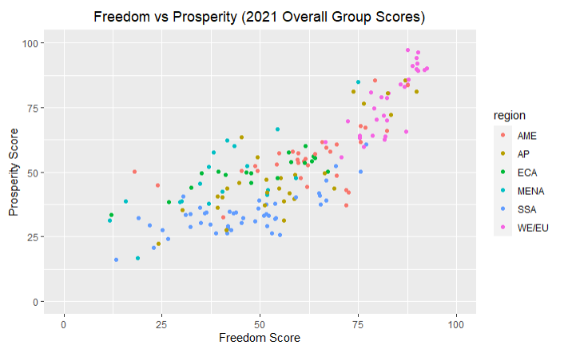{width=100%}

### Freedom Score Analysis

We can analyze the freedom scores for each specific region. Descriptive statistics for freedom score grouped by country region is shown in the table below:

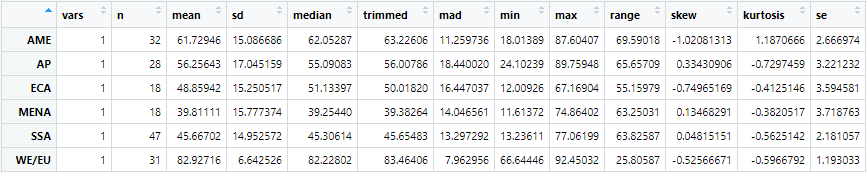{width=100%}

We can also use a box plot to visually see the freedom scores grouped by region.

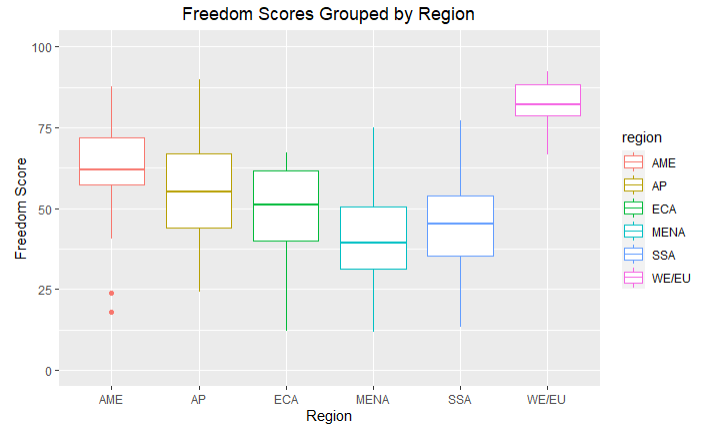{width=100%}

Our dataset has an additional categorical variable for freedom scores. The categorical variable is assigned as follows:

- **Unfree (UF)**: freedom score from 0 to 25
- **Mostly Unfree (MUF)**: freedom score from 25 to 50
- **Mostly Free (MF)**: freedom score from 50 to 75
- **Free (F)**: freedom score from 75 to 100

We can use this categorical variable to generate an additional visualization for country freedom. These bar plots are shown below.

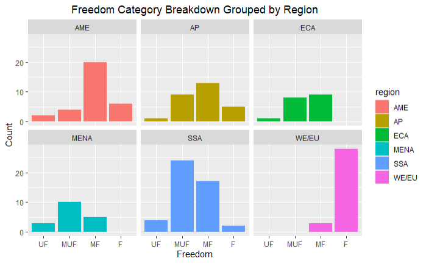{width=100%}


### Freedom Category Score Analysis

We can now look into the three categories for the freedom score (as a reminder, these three category scores are averaged to generate the overall freedom score for each country.) Below are the descriptive statistics and the accompanying box plots for each freedom category.

#### Economic Freedom Scores Descriptive Statistics

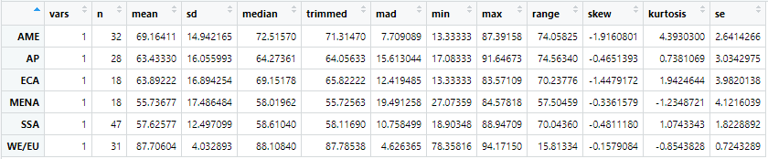{width=100%}

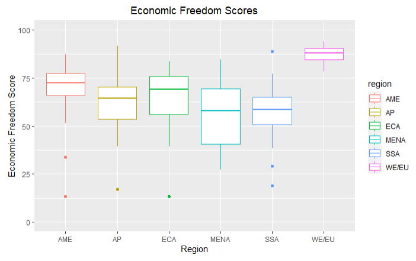{width=100%}

#### Political Freedom Scores Descriptive Statistics

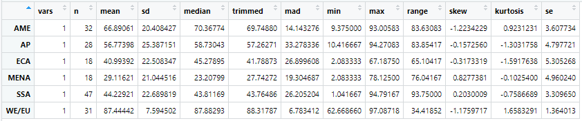{width=100%}

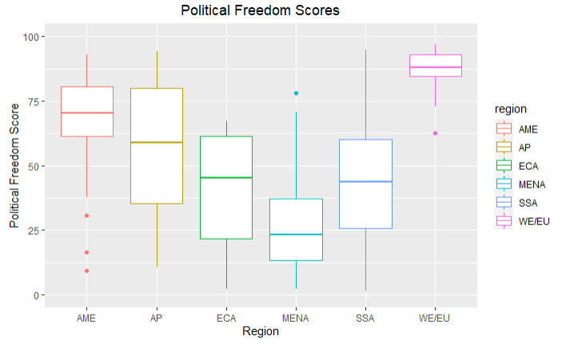{width=100%}

#### Legal Freedom Scores Descriptive Statistics

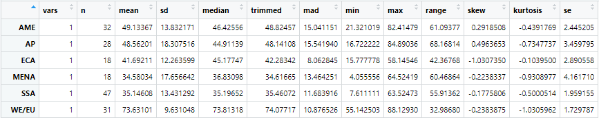{width=100%}

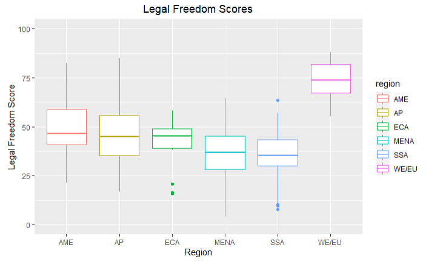{width=100%}

The subcategories for each freedom category will be investigated later in the project.


### Prosperity Score Analysis

Similarly to what we have just done for the freedom scores, we can analyze the prosperity scores by region. Descriptive stats for the prosperity score grouped by region are shown below.

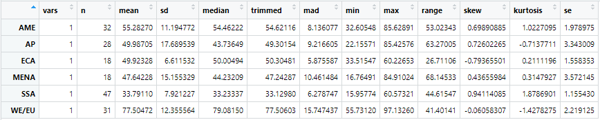{width=100%}

We can also use a box plot to visually see the prosperity scores grouped by region.

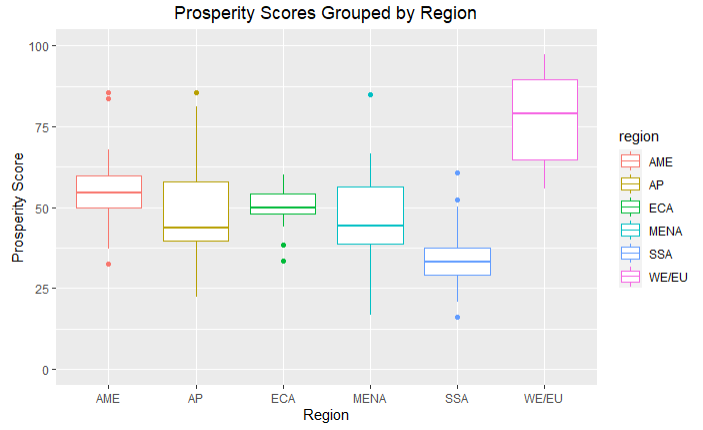{width=100%}

Similarly to the freedom scores, our dataset has an additional categorical variable for prosperity scores. The categorical variable is assigned as follows:

- **Unprosperous (UP)**: prosperity score from 0 to 25
- **Mostly Unprosperous (MUP)**: prosperity score from 25 to 50
- **Mostly Prosperous (MP)**: prosperity score from 50 to 75
- **Prosperous (P)**: prosperity score from 75 to 100

We can use this categorical variable to generate an additional visualization for country prosperity. These bar plots are shown below.

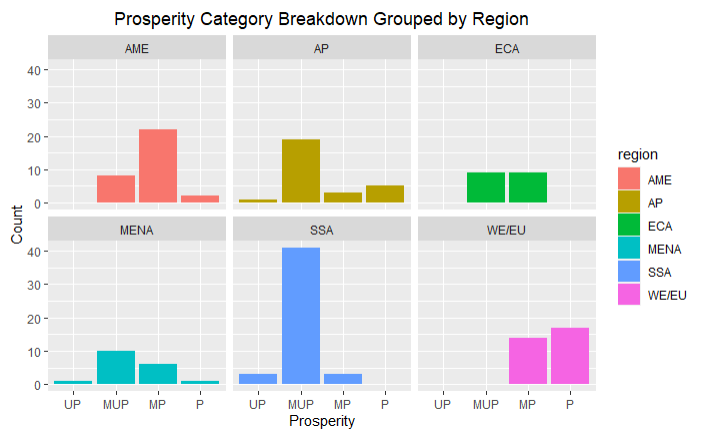{width=100%}

### Prosperity Category Score Analysis

We can now look into the five categories for the prosperity score (as a reminder, these five category scores are averaged to generate the overall prosperity score for each country.) Below are the descriptive statistics and the accompanying box plots for each prosperity category.

#### Income Scores Descriptive Statistics

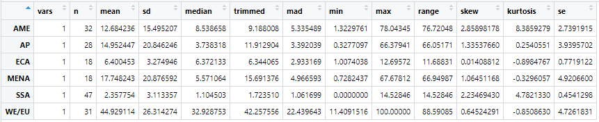{width=100%}

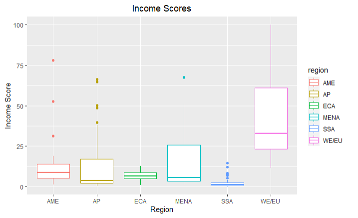{width=100%}

#### Environment Scores Descriptive Statistics

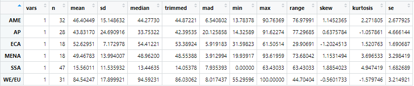{width=100%}

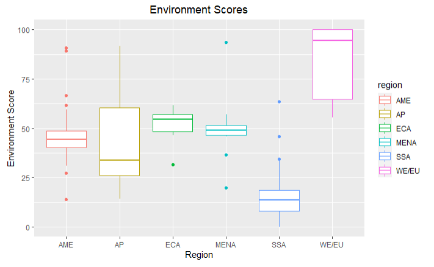{width=100%}

#### Minority Rights Scores Descriptive Statistics

*Note: there are 6 N/A values for Minority Rights prosperity scores in the dataset. These countries were ignored during the below analysis.*

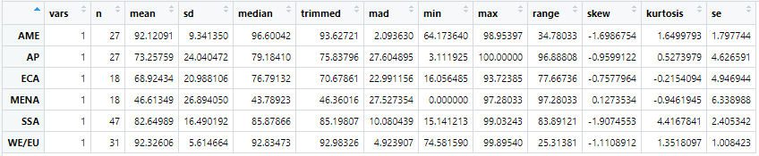{width=100%}

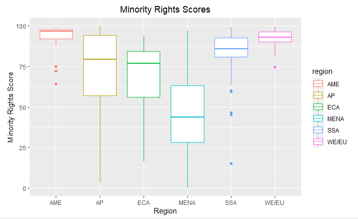{width=100%}

#### Health Scores Descriptive Statistics

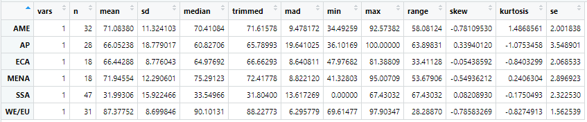{width=100%}

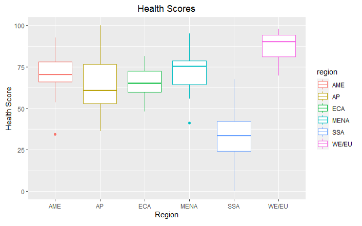{width=100%}

#### Happiness Scores Descriptive Statistics

*Note: there are 18 N/A values for Happiness prosperity scores in the dataset. These countries were ignored during the below analysis.*

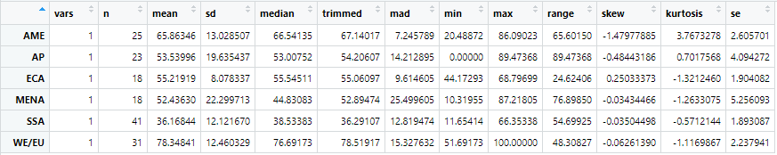{width=100%}

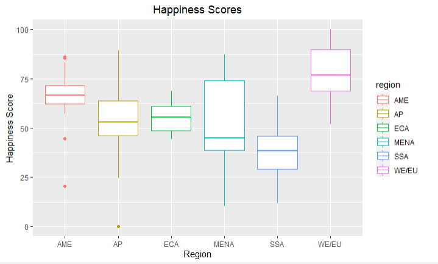{width=100%}

## Exploratory Analysis - Correlations 

We will investigate the correlations between the main categories of Freedom and Prosperity against their subcategories. Next, we will dive into the specific factors of Freedom and obtain the factors that have are highly correlated with the subcategories of Freedom.

## Freedom and its Main Categories


{width=100%}

## Prosperity and its Main Cateogries

{width=100%}

## Freedom Subcategory (1)

{width=80%}

## Freedom Subcategory (2)

{width=100%}

## Freedom Subcategory (3)

{width=80%}


## Statistical Learning Methods

For the following slides, we will be looking at various statistical models that will help with this data analysis project.

## Linear Regression - General Scores

{width=60%}

From this plot we can infer that there seems to be an upward curve resembling an exponential relationship. As there seems to be two large clusters, we will attempt to cluster the groups using Gaussian Mixture Model method.

## Gaussian Mixture Model Clustering

{width=60%}

We can see from the clusters above that there are two clustered groups between the free and prosporous countries against the unfree and unprosperous countries.


## Machine Learning Models for porsperity score preiction

We use several supervised learning methods to build prediction models for prosperity scores based on all the freedom subcategories, and compare their performances. 

## Data Processing and prediction settings 
Our data source is from the Atlantic Council. For every country beginning from 2006 and in every 5 years, the Atlantic Council give it a score for every freedom subcategories and prosperity. Using these scores, we form the training and testing data set. Since the algorithmic models we intend to use are designed for predicting discrete values, we have to classify the prosperity scores into reasonable partitions.In achieving this, the following basic statistical inferences are made:

| mean | median | maximum | minimum | standard deviation| 
| :----: | :----: | :----: | :----: | :----: |
| 48.38 | 50.57 | 98.63 | 15.47 | 19.05 |


The following is the visualization of distribution of prosperity scores amongst all data. 
{width=50%}


We observe that most countries have prosperity score in between 75 and 25 and a few are below 75. It is important to note that by Atlantic Council's definition, 75 is the threshold for developing countries and developed countries and 50 is the threshold for under developing countries and developing countries. We partition our data accordingly by this standard. We set the label 1, 2, and 3, where 1 stands for under developing countries, 2 stands for developing countries, and 3 stands for developed countries. Combining all the data from 2021, 2016, 2011, and 2006, we find that there are 384 under developing labels, 213, developing labels, and 99 developed labels. 

| labels | meaning | threshold | size | 
| :----: | :----: | :----: | :----: |
| 1 | under developing countries | score <= 50 | 384 |
| 2 | developing countries | score <= 75 and score > 50| 213 |
| 3 | developed countries| score > 75| 99 |


Next, we delete all rows where there exists at least one null values. In separating training data and testing data, we use the default 0.8 value, whereby 80% of the data are for training and 20% of the data are for testing. After this process, we find that we have 395 data set for training and 98 for testing. It is also worth while to state that we have 17 features. 

## Decision Tree
Our initial decision tree model yields a 100% accuracy on training data and 82.65% accuracy on testing data. In avoiding over fitting, we then conduct post pruning. Our method is to continuously delete the node with the lowest impurity (least able to classify data) until the test data accuracy is maximized. The lowest impurity is manifested by "effective alpha". The following graph shows the accuracy with every node we prune (the x axis is the lowest effective alpha of ever tree). 

{width=50%}


While training accuracy decreases monotonically with nodes being removed, testing accuracy increases to a pinnacle, and then decreases monotonically. This is performing as expected since as the nodes are being removed, the problem of over fitting is being addressed, and as it starts to decrease, the model becomes to under fitting. In light of this observation, we pick the pinnacle of testing accuracy to be our final decision tree model. We reach a 85.71% accuracy for testing data and 95.94% accuracy for training data. 

In addition, the simplicity of decision tree model also allows us to open the "black box" of the model itself. The following is the visualization of our post pruning model.  

{width=80%}


Such visualization allows us to obtain the nodes with highest impurity. It implies that the nodes are amongst the strongest in separating labels, and hence, they are the most determining factors in implicating prosperity. From descending importance, these variables are: "State capacity", "Absence of Corruption", "Government integrity", and "Efficient judiciary". In light of this finding, we state that an effective governmental apparatus in maintaining law and order correlates with a country's prosperity. 

## Other attempts 
Although we reached a decent accuracy based on random forest, it would be beneficial if we test the performance of other major models. We also attempted random forest, gradient boosting, and neural network. For random forest, we obtain the optimal results after 300 iterations, and for gradient boosting, it is 100 iterations. For neural network, we setup 1 hidden layer and 50 training epochs. The following is the performance of all our models. 

| Model | training data accuracy | testing data accuracy | training data F1 score | testing data F1 score | 
| :----: | :----: | :----: | :----: | :----: |
| Decision tree | 0.960 | 0.857 | 0.960 | 0.859 |
| Random Forest | 1.000 | 0.867 | 1.000 | 0.864 |
| Gradient Boosting | 1.000 | 0.878 | 1.000 | 0.876 |
| Neural Network | 0.486 | 0.480 | 0.654 | 0.648 |

Gradient Boosting and Decision Tree performed slightly better than Decision Tree, while Neural Network's performance is catastrophic, this is possibly due to lack of training data, and preponderance of features. Simple model such as decision tree almost performed as well as Random Forest and Gradient Tree. 


## Time Series Data Analysis with Raw Data

Understanding what variables are important according the correlations of the normalized scores, we will check the current situation of some countries and investigate if the raw data aligns with our findings from the scored dataset.

## Country A

...

## Country B

...


## Conclusion

To summarize, we have learned that ...


